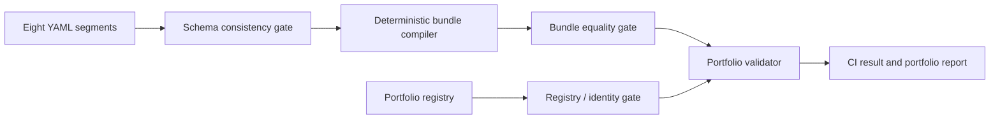

# Architecture

```mermaid
flowchart LR
  A[Eight YAML segments] --> B[Schema consistency gate]
  B --> C[Deterministic bundle compiler]
  C --> D[Bundle equality gate]
  E[Portfolio registry] --> F[Registry / identity gate]
  D --> G[Portfolio validator]
  F --> G
  G --> H[CI result and portfolio report]
```

The segmented YAML files are authoritative. The bundle is compiled output and must never drift from them.
